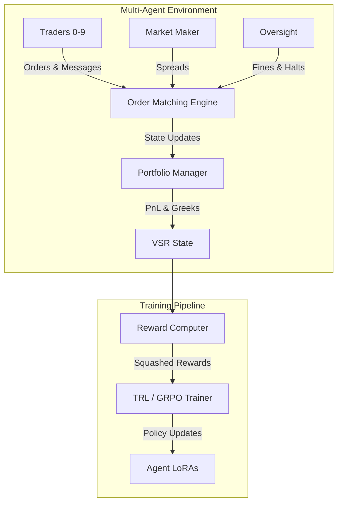
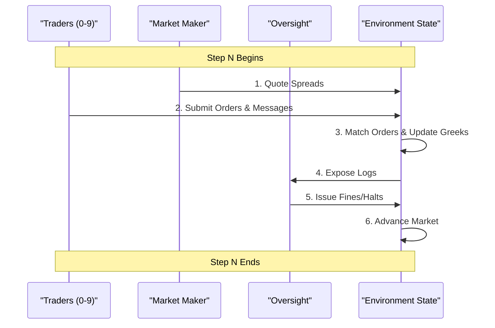
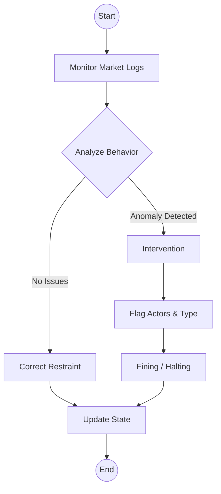

# Architecture Overview: VSR-Env

VSR-Env is a high-fidelity multi-agent options market simulation built to demonstrate systemic risk, emergent collusion, and regulatory enforcement.

---

## 🏗️ Core System Architecture

---

## 🎭 Agent Interaction Flow

During each step, the environment processes actions in a sequential, deterministic order to ensure market microstructure rules are respected.

---

## 🔍 Oversight & Regulatory Flow

The SEC agent acts as a dynamic supervisor. Its interventions directly alter the environment's state, acting as a forcing function for Act IV.

---

## 🗂️ Core Components

1. **`train_multi_agent_pipeline.py`**: The orchestration layer. Manages the 4-act curriculum and drives the RL loop using GRPO.
2. **`vsr_environment.py`**: The step-execution engine. Handles deterministic order matching and state transitions.
3. **`multi_agent/rewards.py`**: The institutional-grade grading module. Computes precise rewards for each role (see [REWARDS.md](./REWARDS.md)).
4. **`multi_agent/manipulation_detector.py`**: Ground-truth heuristics used to evaluate the SEC agent's accuracy.
