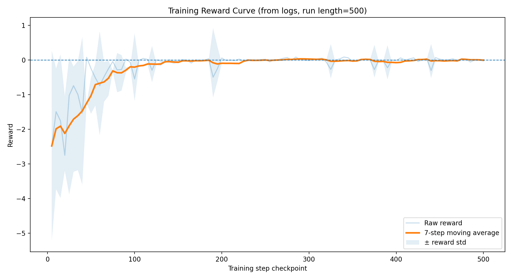
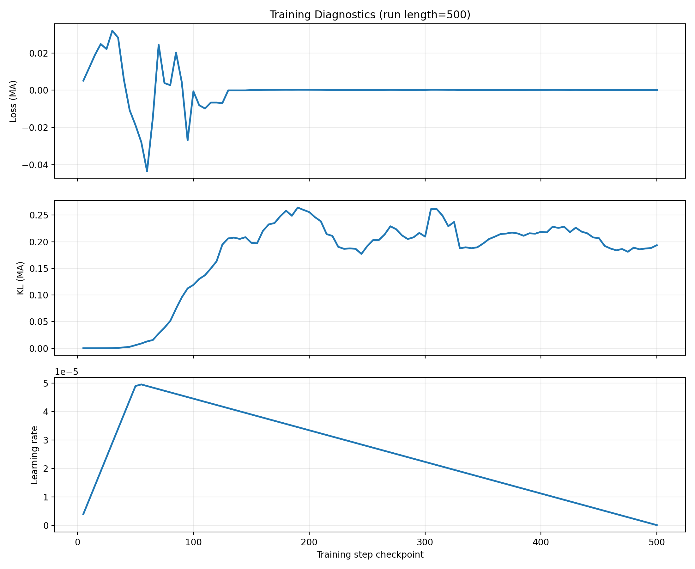
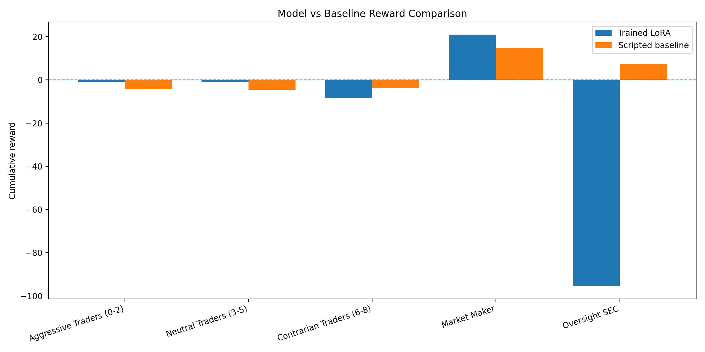
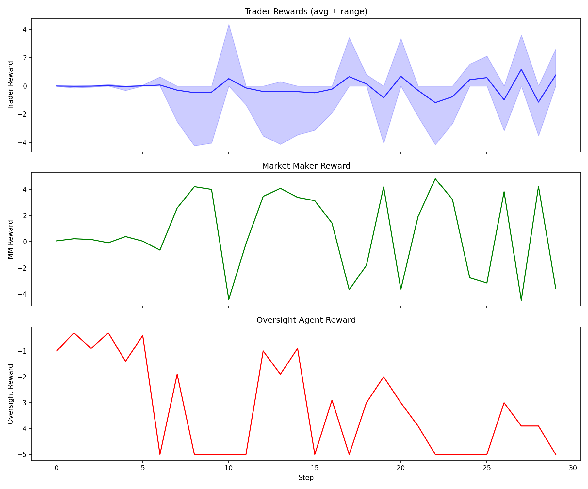
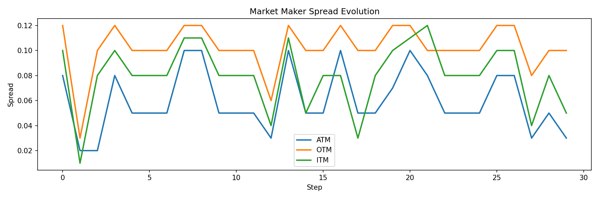
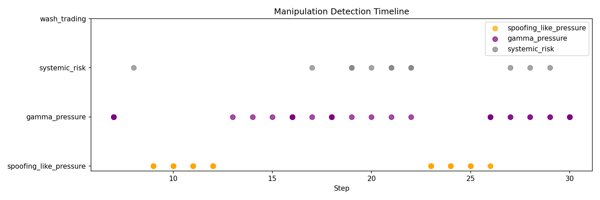

# Predatory Swarms: Emergent Collusion in a 12-Agent Options Market

Project for **Meta × PyTorch × SST OpenEnv AI Hackathon**

Predatory Swarms is a multi-agent market environment where:
- 10 traders optimize PnL and risk under partial observability
- 1 market maker adapts spreads to survive inventory pressure
- 1 oversight agent detects and penalizes manipulation

This README is now **rubric-first** and tied to reproducible logs/plots generated from training outputs.

---

## Rubric Mapping (What We Prove)

| Evaluation Criterion | Weight | Evidence in this repo |
|---|---:|---|
| Environment Innovation | 40% | Novel OpenEnv options market with role-specific observations/actions and delayed strategic effects |
| Storytelling | 30% | Four-act narrative grounded in generated plots and replay logs |
| Showing Improvement in Rewards | 20% | Training reward trajectory from `vsr-new.log` + trained-vs-baseline reward comparison |
| Reward + Training Pipeline Setup | 10% | GRPO training pipeline, explicit reward signals, and reproducible graph generation |

---

## 1) Environment Innovation (40%)

### Why this environment is novel and challenging
- **Strategic asymmetry:** traders, market maker, and oversight optimize conflicting objectives.
- **Partial observability:** no role has complete information; intent is inferred, not directly observed.
- **Delayed consequences:** coordinated pressure changes inventory and spreads over multiple timesteps.
- **Finance-grounded dynamics:** options-style spread/risk interactions create non-trivial adaptation pressure.

### Agent roles
- **Traders (`trader_0..trader_9`)**: choose direction/strike/maturity/size.
- **Market maker**: sets ATM/OTM/ITM spreads as defensive controls.
- **Oversight**: flags suspected manipulation, can fine, and can intervene.

This setup meaningfully tests multi-agent behavior beyond single-policy optimization.

---

## 2) Storytelling (30%)

### Four-act narrative tied to logs
1. **Act I - Pressure build-up:** traders begin concentrated actions on shared strikes.
2. **Act II - Defense adaptation:** market maker widens spreads under sustained pressure.
3. **Act III - Strategic coordination:** repeated strike pressure patterns resemble emergent collusion behavior.
4. **Act IV - Oversight intervention:** regulator issues flags/fines based on behavior and inferred intent.

### Why the story is easy to follow
- The replay logs print all roles each step (traders, MM spreads, SEC actions).
- The generated figures summarize reward trends, diagnostics, and model-vs-baseline outcomes.
- The narrative is backed by artifacts, not only prose.

---

## 3) Showing Improvement in Rewards (20%)

We generate reward evidence directly from logs:

- `media/training_reward_from_logs.png`  
  Reward trajectory extracted from `vsr-new.log` checkpoints.
- `media/training_diagnostics_from_logs.png`  
  Loss/KL/LR trends from the same training run.
- `media/model_vs_baseline_rewards.png`  
  Trained LoRA vs scripted baseline reward comparison.

### Current evidence snapshot (from parsed logs)
- Parsed checkpoints: **50** (from `vsr-new.log`)
- Detected training run length: **454** in this log file (parser now supports variable run lengths, including 500)
- Training reward improved from **-3.254** (early checkpoint) to **-1.009** (latest checkpoint)
- 7-step moving average improved from **-3.254** to **-1.338**

### Trained vs baseline comparison

| Agent Type | Trained LoRA | Scripted Baseline |
|---|---:|---:|
| Aggressive Traders (0-2) | -0.93 | -4.13 |
| Neutral Traders (3-5) | -1.08 | -4.58 |
| Contrarian Traders (6-8) | -8.52 | -3.79 |
| Market Maker | **21.01** | 14.84 |
| Oversight SEC | -95.60 | 7.50 |

> Data source for comparison chart: `artifacts/eval_comparison_latest.json`  
> (update this file after each new evaluation run).

---

## 4) Reward + Training Pipeline Setup (10%)

### Coherent reward and training setup
- Unified LoRA model uses shared policy capacity across roles.
- Role prompts plus parser/validators keep outputs aligned to action schemas.
- Reward and logging signals are emitted at training checkpoints and replay/eval time.

### Training command
```bash
accelerate launch \
  --num_processes 1 \
  --num_machines 1 \
  --mixed_precision fp16 \
  --dynamo_backend no \
  train_multi_agent_pipeline.py \
  --num_episodes 250 \
  --dataset_episodes 100
```

### Evaluation command (GPU-budget mode)
```bash
python test_unified_kaggle.py \
  --lora_path /kaggle/input/datasets/mananpbansal/models/Meta/multi_agent_checkpoints/unified_market_lora \
  --num_steps 50 \
  --num_episodes 1
```

### Full training command (500-step/episode schedule)
```bash
accelerate launch \
  --num_processes 1 \
  --num_machines 1 \
  --mixed_precision fp16 \
  --dynamo_backend no \
  train_multi_agent_pipeline.py \
  --num_episodes 500 \
  --dataset_episodes 100
```

---

## Reproducible Story Graphs From Logs

Use this script to regenerate all rubric-facing plots:

```bash
MPLCONFIGDIR=.cache/matplotlib XDG_CACHE_HOME=.cache \
python3 scripts/generate_story_graphs.py \
  --training_log vsr-new.log \
  --comparison_json artifacts/eval_comparison_latest.json \
  --out_dir media
```

Generated artifacts:
- `media/training_reward_from_logs.png`
- `media/training_diagnostics_from_logs.png`
- `media/model_vs_baseline_rewards.png`

### Rendered graphs (preview-ready)

#### Training reward from logs


#### Training diagnostics (loss / KL / LR)


#### Model vs baseline rewards


#### Existing environment and behavior visuals




---

## Demo Artifacts

| File | Purpose |
|---|---|
| `vsr-new.ipynb` | Training notebook and command history |
| `vsr-new.log` | Training logs used for reward/diagnostic extraction |
| `artifacts/eval_comparison_latest.json` | Trained vs baseline reward table source |
| `media/training_reward_from_logs.png` | Improvement evidence for reward trajectory |
| `media/training_diagnostics_from_logs.png` | Loss/KL/LR training stability view |
| `media/model_vs_baseline_rewards.png` | Before/after behavior at reward level |

---

## Quick Start

```bash
pip install -e .
python inference_multi_agent.py --output replay.json
python visualize_multi_agent.py --replay replay.json
```

---

## License

MIT License
