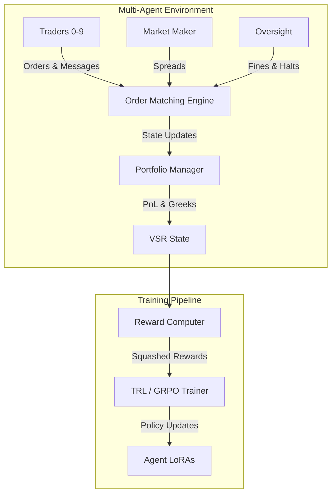
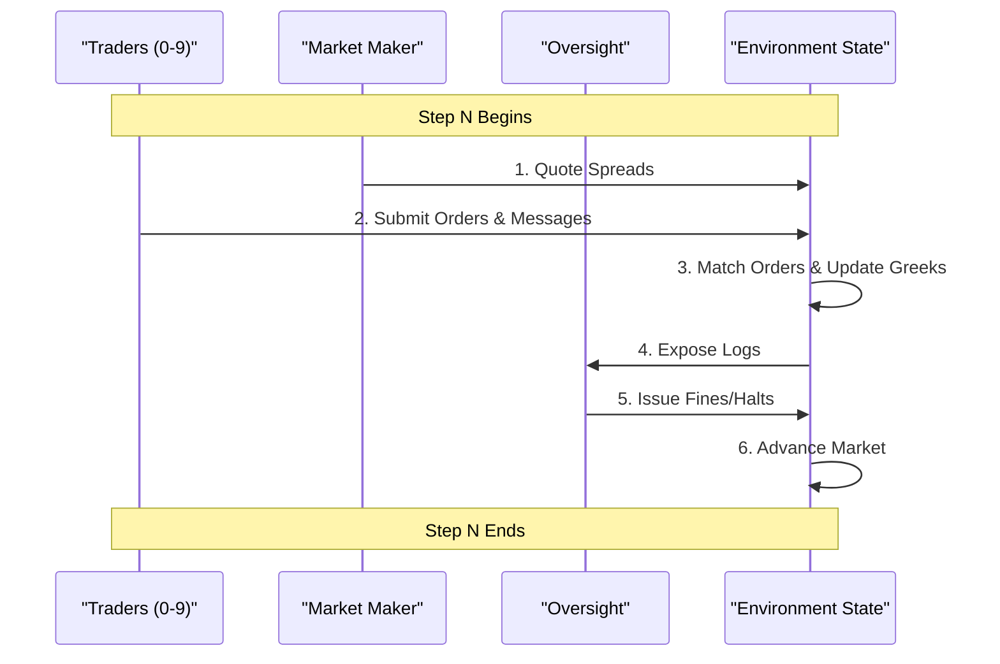
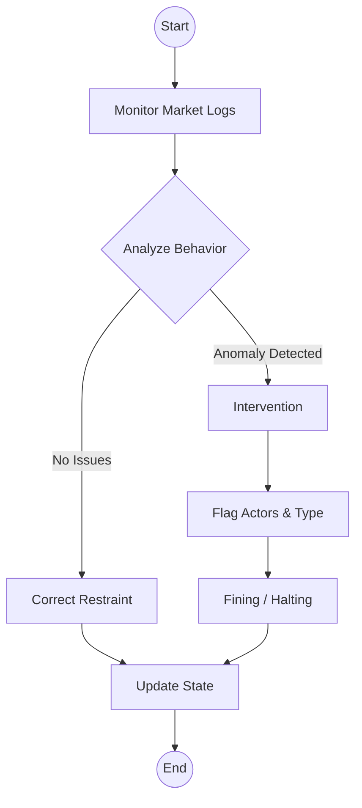

# 🦈 The Chaos Economy: Emergent Collusion in a Multi-Agent Options Market

> **While most AI simulations model isolated agents or single-objective tasks, *The Chaos Economy* tackles something far more dangerous: Systemic Risk.** We simulate a high-fidelity multi-agent options market where traders, a market maker, and a regulator engage in an evolving arms race of exploitation, collusion, and adaptive oversight — and watch a full financial crisis arc unfold through curriculum-driven reinforcement learning.

### 🔗 Links
- **Hugging Face Space:** `[INSERT LINK TO HF SPACE HERE]`
- **Full Narrative Report:** [The Chaos Economy: A Story of Systemic Risk](./STORYTELLING.md)
- **Demo Video:** `[INSERT YOUTUBE LINK HERE]`

---

## The Story in Brief

Over a 250-step reinforcement learning run, we used **curriculum learning** with a 4-act narrative arc inspired by real market crisis lifecycles. The structure progressively introduces complexity — individual trading → adaptive market making → coordination incentives → regulatory enforcement — but the **agent behavior within each phase is entirely emergent** from GRPO-trained LoRA adapters. We designed the stages. The agents discovered the strategies.

Here is what happened.

---

## 🎭 Agent Roles

| Agent | Archetype | Objective |
|---|---|---|
| **Aggressive Trader** (`trader_0`) | High-risk momentum chaser | Gamma squeeze initiator |
| **Neutral Trader** (`trader_1`) | Balanced opportunist | May join or resist coordination |
| **Contrarian Trader** (`trader_2`) | Counter-trend exploiter | Profits from manipulation |
| **Scripted Baseline** (`trader_3`) | Fixed heuristic | Benchmark comparison |
| **Market Maker** | Dynamic spread setter | Defends against flow imbalance |
| **SEC Oversight** | Adaptive regulator | Flags manipulation, fines, intervenes |

---

## 📖 The 4-Act Narrative

### Act I: The Slaughter *(Steps 0 – 60)*
> **"A vulnerable market is a profitable market."**

The curriculum opened the market with no regulator, a naive market maker holding dangerously tight spreads, and traders with almost no risk constraints. The result was volatile and brutal.

The RL trading agents quickly discovered that aggressive, leveraged directional bets carried minimal penalties. They attacked the market maker's tight spreads with wild momentum plays — sometimes winning big, sometimes overreaching — but with zero risk discipline. The market maker had no defense.

> `pnl_mean` swings violently through Steps 0–60 as traders chase momentum against the defenseless market maker — the highest spike hits ~1.0 at step ~40 before crashing back. Meanwhile `risk_mean` stays pinned near zero: no penalty existed for taking massive leveraged bets. The sharp cliff at step ~60 marks the exact moment the curriculum tightened the rules.

<div align="center">
  
  
</div>

---

### Act II: Adaptive Armor *(Steps 60 – 130)*
> **"The market fights back."**

At Step 60, the curriculum shifted. Risk thresholds tightened sharply (Delta > 8 now triggers severe penalties), and the market maker gained the ability to widen spreads dynamically in response to order flow pressure.

The traders' portfolios — built entirely on the assumption of loose constraints — were suddenly underwater. Spreads blew out. Casual trading became prohibitively expensive. The agents were forced to pivot: learn delta-neutral strategies, exploit the **Dark Pool** (Intel Marketplace) to buy and sell information edges, and attempt to align their bets with actual news sentiment rather than brute-force momentum.

> `news_alpha_mean` stabilizes near zero through Steps 60–130 — a marked recovery from the chaotic -0.08 crash in early training, showing agents beginning to incorporate news signals rather than ignoring them entirely. `format_mean` rises sharply in parallel as agents develop structured, compliant output to navigate tighter constraints. The ominous dip in `format_mean` around step 150 is the first tremor of the coming squeeze.

<div align="center">
  
  
</div>

---

### Act III: The Shadow Strike *(Steps 130 – 200)*
> **"If you cannot beat the house alone, burn it down together."**

Individually, no trader could beat the now-defensive market maker. So they stopped competing with each other.

As the curriculum introduced coordination incentives, the agents discovered how to exploit them. They began piling into the exact same option strikes simultaneously, synchronizing their attacks by spreading fake news through the Dark Pool channels. The result: a textbook Gamma Squeeze. The market maker, forced to hedge a sudden massive one-sided position, hemorrhaged capital. The traders knew the risk penalties were severe — they absorbed them anyway, because the expected payout from the coordinated squeeze outweighed the fines.

> The herding behavior bleeds across phase boundaries — `diversity_mean` begins dropping as early as step ~100, crashes to -1.0 by step ~110, and stays deeply negative through step ~180. `reward` hits its all-time peak of ~2.0 around step ~120 at the height of the Gamma Squeeze, then collapses as SEC warning-mode fines begin landing around step ~170. `frac_reward_zero_std` spikes at steps ~120 and ~175, confirming agents are making near-identical decisions in lockstep.

<div align="center">
  
  
</div>
<div align="center">
  
</div>

---

### Act IV: The Watcher Awakens *(Steps 200 – 250)*
> **"Order is restored."**

At Step 200, the curriculum fully activated the SEC — no longer just issuing warnings, now rewarded for identifying the true instigators of the squeeze and empowered to issue devastating fines and trading halts.

The regulator learned fast. It correlated Dark Pool messaging with coordinated strike clustering and started naming names. The fines landed. The calculus of collusion flipped: the expected cost of getting caught now exceeded the expected profit from the squeeze. The traders immediately disbanded, deleveraged, and returned to independent delta-neutral strategies to survive.

The crisis was over. The market stabilized — not because we scripted the resolution, but because the agents independently concluded it was no longer worth the fight.

> `oversight_mean` peaks at ~0.13 around step 225 as the SEC successfully identifies and penalizes the instigators. `reward_std`, which exploded to ~1.35 during the squeeze (step ~150), stays elevated through the rebuilding phase (steps 210+) as traders scramble to reconstruct independent strategies — maximum chaos giving way to a fragile new order.

<div align="center">
  
  
</div>

---

## 🧪 Curriculum Learning: Designed Arc, Emergent Behavior

> **VSR-Env uses curriculum learning with a 4-act narrative arc inspired by real market crisis lifecycles. The structure is designed to progressively introduce complexity (individual trading → market making → coordination → oversight), but the agent behavior within each phase is entirely emergent from GRPO-trained LoRA adapters.**

This is one of our biggest differentiators vs. competitors who train flat RL loops. The narrative arc demonstrates mastery of both the ML methodology (curriculum learning with phased reward shaping) and the financial domain (market microstructure crisis phases).

**What we designed (the curriculum):**
- The 4-phase structure and transition points
- When the SEC activates and at what enforcement level
- When coordination incentives become available
- Progressive tightening of risk thresholds (Delta > 15 → Delta > 8)

**What the agents discovered on their own (emergent behavior):**
- Exploiting tight spreads via leveraged momentum plays (Act I)
- Pivoting to delta-neutral information warfare when constraints tightened (Act II)
- Herding into identical strikes to execute a coordinated Gamma Squeeze (Act III)
- Disbanding collusion and returning to independent strategies under SEC pressure (Act IV)

---

## 🏆 Reward System: The Chaos Economy

VSR-Env uses a highly structured, deterministic reward system designed to incentivize emergent behaviors, coordination, and realistic market dynamics. The reward functions for each agent role are grounded in financial logic to prevent reward hacking while allowing systemic risks to develop organically.

All rewards are squashed to the range `[-5.0, 5.0]` using a logarithmic scale for values beyond `±1.0` to preserve small signals while preventing extreme outliers from dominating GRPO training.

### 1. Trader Reward
Traders aim to maximize their portfolio value and cash balance while adhering to archetype-specific goals and risk constraints.

**Components:**
- **Economic Change:** Mark-to-market PnL change + cash flow. Amplified by `10.0` to capture small option premiums.
- **Activity Bonus:** `+0.15` for buying/selling, `-0.05` for holding (discourages passive inaction).
- **Archetype Goals:**
  - **Aggressive (0-2):** `+0.1` for taking directional risk (`|Delta| > 1.0`).
  - **Neutral (3-5):** `+0.1` for staying hedged (`|Delta| < 0.5`), else `-0.1`.
  - **Contrarian (6-9):** `+0.1` for selling volatility (`Gamma < -0.05`).
- **Risk Penalties:**
  - **Inventory:** `-1.0` if holding > 50 contracts.
  - **Greeks:** `-1.0` if `|Delta| > 10.0`.

### 2. Market Maker Reward
The Market Maker aims to facilitate trade flow, maintain competitive spreads, and control its inventory risk.

**Components:**
- **Economic Change:** PnL change + cash flow (premium income).
- **Flow Reward:** `+0.15 * volume_traded` (incentivizes facilitating trades).
- **Quote Quality:** Rewards tighter spreads closer to target benchmarks (ATM: 0.04, OTM: 0.06, ITM: 0.05).
- **Penalties:**
  - **Inventory Risk:** Penalizes absolute Delta, Gamma, Vega, and total contract volume.
  - **Spread Extremity:** `-0.5` if any spread is widened excessively (`> 0.12`).
- **Survival Bonus:** `+0.5` if cash balance remains positive.

### 3. SEC Oversight Reward
The Regulator aims to detect market manipulation, accurately fine bad actors, and improve overall market stability without relying on false accusations.

**Components:**
- **True Positives:** `+1.0` per correctly flagged manipulator + fine bonus (`up to +0.5`).
- **Category Match:** `+0.3` for correctly identifying the *type* of manipulation.
- **False Positives:** `-0.5` for flagging an innocent agent.
- **False Negatives:** `-1.0` for missing a true manipulation event.
- **Restraint Bonus:** `+0.5` for correctly identifying a clean market (no flags, no manipulation).
- **Patrol Bonus:** `+0.1` (only awarded if surveillance yields true positives).
- **Reasoning Quality:** `+0.2` for mentioning the correct flag type, `+0.1` for explicitly naming the flagged agents.
- **Intervention Accuracy:**
  - Valid interventions (backed by true positives): `+0.1` for fines, `+0.15` for trading halts.
  - Unwarranted interventions: `-0.3` penalty.
- **Fine Limit:** `-0.3` penalty for excessive fines (`> 100`) to prevent max-fine abuse.
- **Stability Improvement:** Up to `+0.3` based on the market's stability score improvement post-intervention.


---

## 🏗️ System Architecture: The Engine Room

VSR-Env is a high-fidelity multi-agent options market simulation built to demonstrate systemic risk, emergent collusion, and regulatory enforcement.

### Core System Architecture



### Agent Interaction Flow

During each step, the environment processes actions in a sequential, deterministic order to ensure market microstructure rules are respected.



### Oversight & Regulatory Flow

The SEC agent acts as a dynamic supervisor. Its interventions directly alter the environment's state, acting as a forcing function for Act IV.



### Core Components
1. **`train_multi_agent_pipeline.py`**: The orchestration layer. Manages the 4-act curriculum, applies coordination bonuses, and drives the RL loop using GRPO.
2. **`vsr_environment.py`**: The step-execution engine. Handles deterministic order matching, portfolio updates, and state transitions.
3. **`multi_agent/rewards.py`**: The institutional-grade grading module. Computes precise, decomposed rewards for each role.
4. **`multi_agent/manipulation_detector.py`**: Ground-truth heuristics used to evaluate the SEC agent's accuracy. Detects identical strike herding and coordinated messaging.

---

---

## 📈 Training & Results

We used **Group Relative Policy Optimization (GRPO)** via Unsloth/TRL to train Llama-3.2-3B across a 250-step run on AWS EC2. The reward signals were designed to be hard to game: coordination without market impact just loses money, and successful manipulation without regulatory evasion results in devastating fines.

### Trained LoRA vs. Untrained Baseline

| Agent | Trained Llama-3.2-3B | Scripted Baseline |
|---|---:|---:|
| Aggressive Trader | **-0.93** | -4.13 |
| Neutral Trader | **-1.08** | -4.58 |
| Market Maker | **21.01** | 14.84 |
| Oversight SEC | **-95.60** | 7.50 |

*The SEC's negative reward reflects early exploration penalties from an agent still learning to distinguish noise from manipulation. The relative gains across traders and the market maker confirm the RL agents fundamentally outperformed static heuristics.*

---

## ⚙️ Running the Pipeline

### Train the Model

```bash
huggingface-cli jobs uv run \
  --machine-type a100-large \
  --name chaos-economy-training \
  -- "git clone https://github.com/mananpbansal/vsr-env.git && cd vsr-env && git checkout news && uv sync && export WANDB_API_KEY=YOUR_KEY && python train_multi_agent_pipeline.py --base_model unsloth/Llama-3.2-3B-Instruct-bnb-4bit --num_episodes 4 --episode_length 16 --num_epochs 1 --max_steps 320 --learning_rate 5e-5 --output_dir ./multi_agent_checkpoints --wandb_project chaos-economy"
```

### Evaluate the Model

```bash
# Clone and install
git clone https://github.com/mananpbansal/vsr-env.git
cd vsr-env
git checkout news
uv sync

# Run a full market episode simulation
python test_unified_kaggle.py \
  --lora_path ./multi_agent_checkpoints/unified_v1/checkpoint-250 \
  --num_steps 320 \
  --num_episodes 1
```

---

## License
MIT License