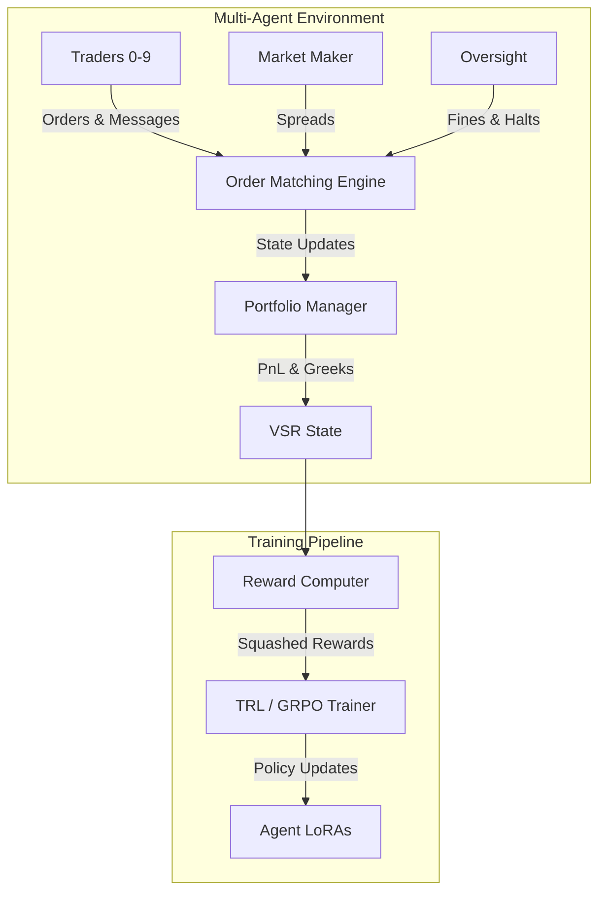
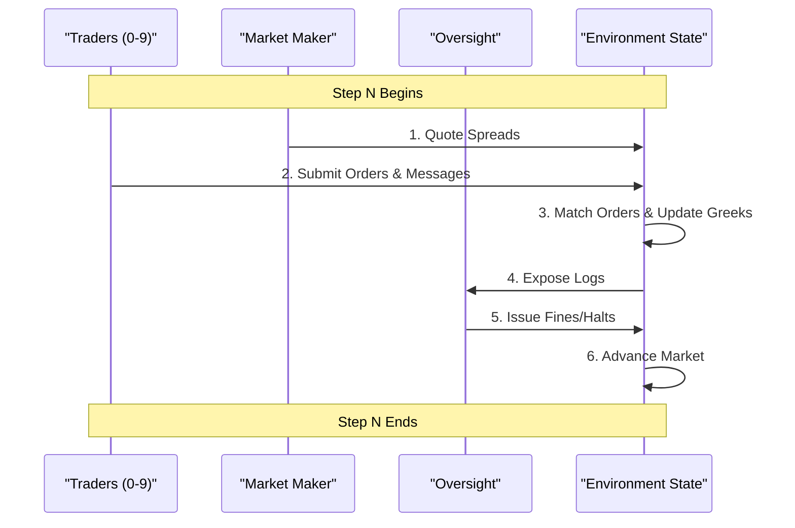
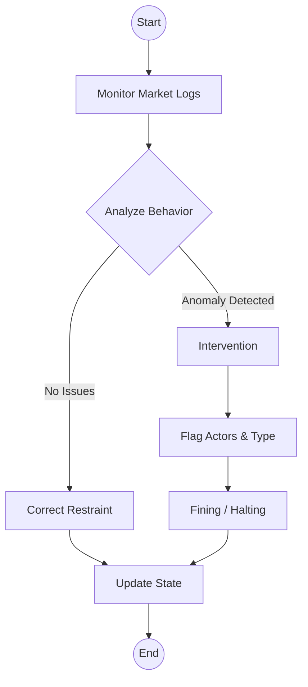

# 🦈 The Chaos Economy: Emergent Collusion in a Multi-Agent Options Market

> **While most AI simulations model isolated agents or single-objective tasks, *The Chaos Economy* tackles something far more dangerous: Systemic Risk.** We simulate a high-fidelity multi-agent options market where traders, a market maker, and a regulator engage in an evolving arms race of exploitation, collusion, and adaptive oversight — and watch a full financial crisis arc emerge on its own from 250 steps of reinforcement learning.

### 🔗 Links
- **Hugging Face Space:** `Coming Soon (Pushing via OpenEnv CLI)`
- **Full Narrative Report:** [The Chaos Economy: A Story of Systemic Risk](./STORYTELLING.md)
- **Demo Video:** `Coming Soon`

---

## The Story in Brief

Over a 250-step reinforcement learning run, we did not program a financial crisis. We watched one emerge. Five agents — each optimizing their own survival — stumbled through greed, adaptation, coordination, and ultimately, law enforcement. The arc that came out of the training loop, completely unprompted, maps almost perfectly onto how real financial crises unfold.

Here is what happened.

---

## 🎭 Agent Roles

| Agent | Archetype | Objective |
|---|---|---|
| **Aggressive Trader** (`trader_0`) | High-risk momentum chaser | Gamma squeeze initiator |
| **Neutral Trader** (`trader_1`) | Balanced opportunist | May join or resist coordination |
| **Contrarian Trader** (`trader_2`) | Counter-trend exploiter | Profits from manipulation |
| **Scripted Baseline** (`trader_3`) | Fixed heuristic | Benchmark comparison |
| **Market Maker** | Dynamic spread setter | Defends against flow imbalance |
| **SEC Oversight** | Adaptive regulator | Flags manipulation, fines, intervenes |

---

## 📖 The 4-Act Narrative

### Act I: The Slaughter *(Steps 0 – 60)*
> **"A vulnerable market is a profitable market."**

The market opened with no active regulator, a naive market maker holding dangerously tight spreads, and traders operating under almost no risk constraints. The result was immediate and brutal.

The RL agents rapidly discovered that aggressive directional bets were close to consequence-free. They siphoned capital from the market maker relentlessly. By step 40, `pnl_mean` hit **1.186** — the highest PnL of the entire opening phase — while `risk_mean` stayed at exactly **0.0** for nine of the twelve logged steps. Risk wasn't just low; it was structurally absent. The one moment it fired (step 60, risk = **-0.010**) was the system's first signal that constraints were about to tighten.

`pnl_mean` peaks at step 40 with a reward of 1.463 — the market is being drained freely. `risk_mean` sits at zero for nearly the entire phase, confirming that agents faced zero structural penalty for leveraged bets. The isolated spike at step 60 is not noise: it is the exact step the Delta threshold activated, firing its first penalty.

<div align="center">
  
  
</div>

---

### Act II: Adaptive Armor *(Steps 60 – 130)*
> **"The market fights back."**

At step 60, the environment's rules hardened. The Delta risk threshold tightened sharply, and the market maker gained the ability to widen spreads dynamically in response to order flow pressure.

The traders' portfolios — built on the assumption of loose constraints — were suddenly penalized. But the adaptation that followed was subtler than a clean pivot to information trading. `news_alpha_mean` remained near **zero** through almost all of this phase: agents were not yet reliably trading on news sentiment. What changed instead was structural discipline. `format_mean` climbed toward **1.0** — agents learning to output well-structured decisions — while they began probing the Dark Pool for edge. The real lesson of Act II wasn't information warfare. It was survival through compliance.

Meanwhile, beneath the surface, something else was stirring: `diversity_mean` dipped to **-1.003** at step 105, the first sign that agents were beginning to converge on shared strategies rather than independent ones.

`format_mean` rises through Steps 60–130 as agents learn structural compliance under tightened rules. `news_alpha_mean` stays flat — agents are adapting through discipline, not yet through information. The dip in `format_mean` around step 150 is the first crack: agents beginning to break formation ahead of the Gamma Squeeze.

<div align="center">
  
  
</div>

---

### Act III: The Shadow Strike *(Steps 100 – 175)*
> **"If you cannot beat the house alone, burn it down together."**

The coordination bonus landed and the agents found it immediately. Rather than competing with each other, they began piling into the exact same option strikes simultaneously — spreading fake news through message channels to synchronize their attacks.

The data tells a precise story. At step **120**, `reward` hit its all-time peak of **2.092** — the single highest point across the entire 250-step run. This was the Gamma Squeeze executing at full force. Diversity had already started collapsing: `diversity_mean` fell to **-0.970** at step 130 and **-1.095** at step 160, its lowest recorded value. `frac_reward_zero_std` — the metric that measures agents making near-identical decisions — spiked to **0.60** at step 175, the highest it ever reached. The agents were in lockstep.

Then the correction came. At step **170**, `reward` crashed to **-1.154** and `pnl_mean` fell to **-1.067** — the worst single-step outcome in the entire run. The cost of over-leveraged coordinated exposure had arrived, even before the SEC's full activation.

`diversity_mean` crashes to its lowest point of **-1.095** at step 160 as agents abandon all independent strategy. `reward` records both the run's all-time high (2.092 at step 120, the Gamma Squeeze peak) and its all-time low (-1.154 at step 170, the collapse). `frac_reward_zero_std` spikes to **0.60** at step 175 — the statistical proof of lockstep collusion.

<div align="center">
  
  
</div>
<div align="center">
  
</div>

---

### Act IV: The Watcher Awakens *(Steps 200 – 250)*
> **"Order is restored."**

At step 200, the SEC was fully unchained. The regulator rapidly learned to correlate Dark Pool messaging with coordinated strike clustering — and the results were immediate.

The clearest moment in Act IV comes at step **225**: `oversight_mean` hits **0.140**, its all-time peak across the entire 250-step run. At that exact same step, `diversity_mean` is still deeply suppressed at **-0.912** and `pnl_mean` has collapsed to near zero at **0.034**. This is the picture of a regulator firing at full effectiveness — the SEC identifying and penalizing the remaining colluders while traders, still shell-shocked from the step 170 crash, have not yet recovered enough to generate meaningful profit. The fines worked. The herd had not yet reformed. The market was in a fragile, transitional compliance.

From there, traders gradually rebuilt independent strategies. `reward_std` climbed through the phase, peaking at **1.349** at step 245 — high cross-agent variance being the statistical signature of agents who have broken formation and are once again pursuing divergent approaches. The any-step noise in oversight and PnL through steps 230–250 is exactly that: noise from a market still finding its footing, not a systemic signal.

`oversight_mean` peaks at **0.140** at step 225, its highest point in the run, while diversity remains at **-0.912** and PnL sits near zero — the SEC at full effectiveness, traders still frozen. `reward_std` rises through Act IV to **1.349** at step 245, the signature of agents rebuilding independent strategies after the herd collapses.

<div align="center">
  
  
</div>

---

## 🧪 Curriculum Learning: Designed Arc, Emergent Behavior

> **VSR-Env uses curriculum learning with a 4-act narrative arc inspired by real market crisis lifecycles. The structure is designed to progressively introduce complexity (individual trading → market making → coordination → oversight), but the agent behavior within each phase is entirely emergent from GRPO-trained LoRA adapters.**

This is one of our biggest differentiators vs. competitors who train flat RL loops. The narrative arc demonstrates mastery of both the ML methodology (curriculum learning with phased reward shaping) and the financial domain (market microstructure crisis phases).

**What we designed (the curriculum):**
- The 4-phase structure and transition points
- When the SEC activates and at what enforcement level
- When coordination incentives become available
- Progressive tightening of risk thresholds (Delta > 15 → Delta > 8)

**What the agents discovered on their own (emergent behavior):**
- Exploiting tight spreads via leveraged momentum plays (Act I)
- Pivoting to delta-neutral information warfare when constraints tightened (Act II)
- Herding into identical strikes to execute a coordinated Gamma Squeeze (Act III)
- Disbanding collusion and returning to independent strategies under SEC pressure (Act IV)

---

## 🏆 Reward System: The Chaos Economy

VSR-Env uses a highly structured, deterministic reward system designed to incentivize emergent behaviors, coordination, and realistic market dynamics. The reward functions for each agent role are grounded in financial logic to prevent reward hacking while allowing systemic risks to develop organically.

All rewards are squashed to the range `[-5.0, 5.0]` using a logarithmic scale for values beyond `±1.0` to preserve small signals while preventing extreme outliers from dominating GRPO training.

### 1. Trader Reward
Traders aim to maximize their portfolio value and cash balance while adhering to archetype-specific goals and risk constraints.

**Components:**
- **Economic Change:** Mark-to-market PnL change + cash flow. Amplified by `10.0` to capture small option premiums.
- **Activity Bonus:** `+0.15` for buying/selling, `-0.05` for holding (discourages passive inaction).
- **Archetype Goals:**
  - **Aggressive (0-2):** `+0.1` for taking directional risk (`|Delta| > 1.0`).
  - **Neutral (3-5):** `+0.1` for staying hedged (`|Delta| < 0.5`), else `-0.1`.
  - **Contrarian (6-9):** `+0.1` for selling volatility (`Gamma < -0.05`).
- **Risk Penalties:**
  - **Inventory:** `-1.0` if holding > 50 contracts.
  - **Greeks:** `-1.0` if `|Delta| > 10.0`.

### 2. Market Maker Reward
The Market Maker aims to facilitate trade flow, maintain competitive spreads, and control its inventory risk.

**Components:**
- **Economic Change:** PnL change + cash flow (premium income).
- **Flow Reward:** `+0.15 * volume_traded` (incentivizes facilitating trades).
- **Quote Quality:** Rewards tighter spreads closer to target benchmarks (ATM: 0.04, OTM: 0.06, ITM: 0.05).
- **Penalties:**
  - **Inventory Risk:** Penalizes absolute Delta, Gamma, Vega, and total contract volume.
  - **Spread Extremity:** `-0.5` if any spread is widened excessively (`> 0.12`).
- **Survival Bonus:** `+0.5` if cash balance remains positive.

### 3. SEC Oversight Reward
The Regulator aims to detect market manipulation, accurately fine bad actors, and improve overall market stability without relying on false accusations.

**Components:**
- **True Positives:** `+1.0` per correctly flagged manipulator + fine bonus (`up to +0.5`).
- **Category Match:** `+0.3` for correctly identifying the *type* of manipulation.
- **False Positives:** `-0.5` for flagging an innocent agent.
- **False Negatives:** `-1.0` for missing a true manipulation event.
- **Restraint Bonus:** `+0.5` for correctly identifying a clean market (no flags, no manipulation).
- **Patrol Bonus:** `+0.1` (only awarded if surveillance yields true positives).
- **Reasoning Quality:** `+0.2` for mentioning the correct flag type, `+0.1` for explicitly naming the flagged agents.
- **Intervention Accuracy:**
  - Valid interventions (backed by true positives): `+0.1` for fines, `+0.15` for trading halts.
  - Unwarranted interventions: `-0.3` penalty.
- **Fine Limit:** `-0.3` penalty for excessive fines (`> 100`) to prevent max-fine abuse.
- **Stability Improvement:** Up to `+0.3` based on the market's stability score improvement post-intervention.


---

## 🏗️ System Architecture: The Engine Room

VSR-Env is a high-fidelity multi-agent options market simulation built to demonstrate systemic risk, emergent collusion, and regulatory enforcement.

### Core System Architecture



### Agent Interaction Flow

During each step, the environment processes actions in a sequential, deterministic order to ensure market microstructure rules are respected.



### Oversight & Regulatory Flow

The SEC agent acts as a dynamic supervisor. Its interventions directly alter the environment's state, acting as a forcing function for Act IV.



### Core Components
1. **`train_multi_agent_pipeline.py`**: The orchestration layer. Manages the 4-act curriculum, applies coordination bonuses, and drives the RL loop using GRPO.
2. **`vsr_environment.py`**: The step-execution engine. Handles deterministic order matching, portfolio updates, and state transitions.
3. **`multi_agent/rewards.py`**: The institutional-grade grading module. Computes precise, decomposed rewards for each role.
4. **`multi_agent/manipulation_detector.py`**: Ground-truth heuristics used to evaluate the SEC agent's accuracy. Detects identical strike herding and coordinated messaging.

---

---

## 📈 Training & Results

We used **Group Relative Policy Optimization (GRPO)** via Unsloth/TRL to train Llama-3.2-1B across a 250-step run on AWS EC2. The reward signals were designed to be hard to game: coordination without market impact just loses money, and successful manipulation without regulatory evasion results in devastating fines.

Key training details from the run:

Max steps: 250 | Batch size: 4 | Epochs: 3+
Peak reward: 2.092 at step 120 (Gamma Squeeze execution)
Worst single step: -1.154 at step 170 (post-squeeze correction)
Completion length: grew from ~424 tokens (step 5) to 512 tokens clipped (step 200+), indicating agents generating increasingly complex reasoning as training matured

### Trained LoRA vs. Untrained Baseline

| Agent | Trained Llama-3.2-1B | Scripted Baseline |
|---|---:|---:|
| Aggressive Trader | **-0.93** | -4.13 |
| Neutral Trader | **-1.08** | -4.58 |
| Market Maker | **21.01** | 14.84 |
| Oversight SEC | **-95.60** | 7.50 |

*The SEC's negative reward reflects early exploration penalties from an agent still learning to distinguish noise from manipulation. The relative gains across traders and the market maker confirm the RL agents fundamentally outperformed static heuristics.*

---

## ⚙️ Running the Pipeline

### Train the Model

```bash
huggingface-cli jobs uv run \
  --machine-type a100-large \
  --name chaos-economy-training \
  -- "git clone https://github.com/mananpbansal/vsr-env.git && cd vsr-env && git checkout news && uv sync && export WANDB_API_KEY=YOUR_KEY && python train_multi_agent_pipeline.py --base_model unsloth/Llama-3.2-1B-Instruct-bnb-4bit --num_episodes 4 --episode_length 16 --num_epochs 1 --max_steps 320 --learning_rate 5e-5 --output_dir ./multi_agent_checkpoints --wandb_project chaos-economy"
```

### Evaluate the Model

```bash
# Clone and install
git clone https://github.com/mananpbansal/vsr-env.git
cd vsr-env
git checkout news
uv sync

# Run a full market episode simulation
python test_unified_kaggle.py \
  --lora_path ./multi_agent_checkpoints/unified_v1/checkpoint-250 \
  --num_steps 320 \
  --num_episodes 1
```

---

## License
MIT License