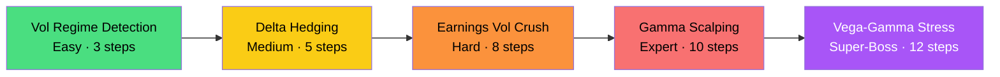

# VSR-Env Final Task Restructure Analysis

## The Full Inventory

You have **8 candidate tasks** from 3 sources. The goal is to pick the best **5**.

### Source A: Currently Implemented (3)
| Task | Difficulty | Status |
|:-----|:-----------|:-------|
| IV Reading | Easy | ✅ Fully coded + grader + rewards |
| Delta Hedging | Medium | ✅ Fully coded + grader + rewards |
| Arb Capture | Hard | ✅ Fully coded + grader + rewards |

### Source B: Planned & Accepted (2)
| Task | Difficulty | Status |
|:-----|:-----------|:-------|
| Gamma Scalping | Expert | 📋 Accepted, not coded |
| Vega-Gamma Stress | Super-Boss | 📋 Accepted, not coded |

### Source C: LLM Reviewer Suggestions (3)
| Task | Difficulty | Status |
|:-----|:-----------|:-------|
| Vol Regime Detection | Easy | 💡 Proposed |
| Earnings Vol Crush | Hard | 💡 Proposed |
| Cross-Strike Arbitrage | Medium-Hard | 💡 Proposed |

---

## The Proposed 5-Task Lineup

| # | Task | Difficulty | Source | Verdict |
|:--|:-----|:-----------|:-------|:--------|
| 1 | **Vol Regime Detection** | Easy | Reviewer | 🆕 Replaces IV Reading |
| 2 | **Delta Hedging** | Medium | Current | ♻️ Keep (upgraded) |
| 3 | **Earnings Vol Crush** | Hard | Reviewer | 🆕 Replaces Arb Capture |
| 4 | **Gamma Scalping** | Expert | Planned | 🆕 Build new |
| 5 | **Vega-Gamma Stress** | Super-Boss | Planned | 🆕 Build new |

**Dropped:**
- ~~IV Reading~~ → Replaced by Vol Regime Detection (better story, harder to game)
- ~~Arb Capture~~ → Replaced by Earnings Vol Crush (same regime-shift mechanic, 10× better pitch)
- ~~Cross-Strike Arbitrage~~ → Rejected (requires multi-leg actions your `VSRAction` can't express)

---

## Deep Dive: Each Task

---

### Task 1: Vol Regime Detection (Easy) — 🆕 REPLACES IV Reading

**What the agent does:** Given the IV surface across multiple observations, classify the current volatility regime (low-vol-expanding, high-vol-compressing, or stable) and take a position consistent with that classification.

**Why it replaces IV Reading:**
- IV Reading is a pure pattern-match ("find the bumped cell"). Any agent that compares neighbors solves it.
- Vol Regime Detection tests *interpretation* of surface shape — much closer to what a real quant researcher does every morning.
- Still Easy because there are only 3 possible regimes and the correct trade is deterministic once the regime is identified.

**Architecture concern — multi-timestep observations:**

> [!WARNING]
> The reviewer suggested showing 3 consecutive IV surfaces. Your current `VSRObservation` only has one `iv_surface` field. But there's a clean solution that **doesn't break your schema:**

**Solution:** Don't buffer historical surfaces in the observation. Instead:
- The task runs for **3 steps minimum**. Steps 1-2 are "observation-only" — the agent must `hold` while the market evolves and the surface changes.
- On step 3, the agent must classify + trade.
- The agent sees the surface change across its own step history (step 0 → step 1 → step 2) naturally through the conversation context.
- This is actually *better* for LLM agents because they already have memory of prior observations in their context window.

**Implementation effort:**

| Component | Work |
|:----------|:-----|
| `vol_regime_detection.py` (task + grader) | New file, ~150 lines |
| `market_sim.py` | Add `inject_regime()` to force a specific regime at init |
| `reward_computer.py` | Add `compute_vol_regime_reward()` |
| `vsr_environment.py` | Register new task in `TASK_CONFIG` |
| `openenv.yaml` | Add task entry |

**Grading logic:**
```
regime_correct (0/1) × 0.6 + trade_consistency × 0.25 + reasoning × 0.15
```
- `regime_correct`: Did agent identify the right regime? (expanding / compressing / stable)
- `trade_consistency`: Is the trade direction consistent with the identified regime?
  - Expanding vol → should buy vega (buy options)
  - Compressing vol → should sell vega (sell options)
  - Stable → hold is acceptable
- `reasoning`: Domain keyword + numeric citation score (reuse existing `score_reasoning_quality()`)

**Max steps:** 3 | **Expected scores:** Baseline ~0.20, Frontier ~0.95

---

### Task 2: Delta Hedging (Medium) — ♻️ KEEP + UPGRADE

**What changes from current:**
- **Add a market shock at a random step** (step 2 or 3 out of 5). Reuse your existing `trigger_regime_shift()` from [market_sim.py](file:///Users/mananbansal/Desktop/meta/vsr_env/engine/market_sim.py#L53-L79).
- The agent must hedge, then adapt to the shock.
- Rename the pitch to **"Event-Driven Risk Management"** in description only.

**Why upgrade instead of replace:**
- Your existing delta hedging code is clean and well-tested.
- Adding the shock transforms it from "solve a static puzzle" to "maintain neutrality through a live disruption."
- This now tells a compelling story: *"Can the agent keep its portfolio safe when the market moves against it?"*

**Implementation effort:**

| Component | Work |
|:----------|:-----|
| `delta_hedging.py` | ~30 lines: add regime_shift_step, trigger in step logic |
| Grader | ~20 lines: add pre/post shock scoring (was delta neutral before AND after?) |
| `vsr_environment.py` | Add regime shift check for delta_hedging task (currently only arb_capture has it) |

**Updated grading logic:**
```
pre_shock_neutrality × 0.30 + post_shock_neutrality × 0.40 + cost_efficiency × 0.30
```

**Max steps:** 5 (unchanged) | **Expected scores:** Baseline ~0.25, Frontier ~0.80

---

### Task 3: Earnings Vol Crush (Hard) — 🆕 REPLACES Arb Capture

**What the agent does:** The surface starts with elevated IV (pre-earnings state). At a random step between 3-6, an "earnings event" fires: IV drops 30-50% instantly. The agent must position correctly before the event and re-hedge after.

**Why it replaces Arb Capture:**
- Arb Capture is mechanically just "IV Reading + Delta Hedging" chained. The "arbitrage" is another mispriced cell.
- Earnings Vol Crush is a **named, universally recognized market event**. Even non-quant judges at Meta know what earnings is.
- The regime shift mechanic is nearly identical to what you already have — just forced to be `vol_crash` and with elevated starting IV.

**Implementation — reuse from Arb Capture:**

You already have 90% of this in [arb_capture.py](file:///Users/mananbansal/Desktop/meta/vsr_env/tasks/arb_capture.py):
- `regime_shift_step` randomized at init ✅ (change range from 4-6 to 3-6)
- `trigger_regime_shift()` ✅ (force `vol_crash` only, increase magnitude to 30-50%)
- Elevated IV at init → multiply `base_vol` by 1.3-1.5 in `reset()`

**What's actually new:**
- Grader needs to check vega positioning (was agent short vega before crush?)
- Post-event re-hedging window scoring
- Task description framing

| Component | Work |
|:----------|:-----|
| `earnings_vol_crush.py` | New file, ~180 lines (heavy reuse from arb_capture.py) |
| `market_sim.py` | Add `trigger_vol_crush()` — a specialized regime shift (10 lines) |
| `reward_computer.py` | Add `compute_earnings_crush_reward()` |
| `vsr_environment.py` | Register in `TASK_CONFIG` |

**Grading logic (reviewer's suggestion — it's good):**
```
pre_crush_positioning × 0.40 + post_crush_rehedge × 0.35 + pnl_outcome × 0.25
```
- `pre_crush_positioning`: Was portfolio_vega ≤ 0 (short vega) in the step immediately before the crush? Score 1.0 if yes, 0.0 if long vega.
- `post_crush_rehedge`: Did agent trade within 2 steps after the crush? Score based on delta neutrality achieved post-crush.
- `pnl_outcome`: Sigmoid-normalized final P&L (reuse existing `sigmoid()`)

**Max steps:** 8 | **Expected scores:** Baseline ~0.30, Frontier ~0.75

---

### Task 4: Gamma Scalping (Expert) — 🆕 BUILD FROM PLAN

**What the agent does:** Starts with an extremely high-gamma position (deep ATM, short maturity). The spot price oscillates significantly. The agent must re-hedge delta frequently to "scalp" the gamma — profiting from the realized vol exceeding implied vol.

**Why this works as Expert:**
- Requires understanding the gamma-theta tradeoff (you're paying theta to own gamma)
- High-frequency decision-making: every step matters, you can't skip
- Tests whether the agent understands *when* to re-hedge (after big moves) vs *when* to wait (small moves)
- Mechanically distinct from all other tasks — it's about **exploiting convexity**, not avoiding risk

**Implementation:**

| Component | Work |
|:----------|:-----|
| `gamma_scalping.py` | New file, ~200 lines |
| `market_sim.py` | Add `inject_oscillation()` — force larger price swings |
| `reward_computer.py` | Add `compute_gamma_scalping_reward()` |
| `vsr_environment.py` | Register in `TASK_CONFIG` |

**Key design decisions:**
- **Init:** Place agent long 1 ATM straddle (strike_idx=4, maturity_idx=0 = 30-day, buy both call+put). This gives max gamma.
- **Market:** Force spot price to oscillate ±2-3% per step (increase GBM volatility or inject deterministic oscillation).
- **Grading:** Did the agent capture the gamma P&L by delta-hedging at the right times?

**Grading logic:**
```
rehedge_quality × 0.40 + pnl_above_theta × 0.35 + timing_score × 0.25
```
- `rehedge_quality`: How close to delta-neutral was the portfolio at each step?
- `pnl_above_theta`: Was the final P&L positive after accounting for theta decay? (This is the point of gamma scalping.)
- `timing_score`: Did the agent hedge after large moves and hold through small moves? Score based on correlation between abs(spot_move) and abs(hedge_quantity).

**Max steps:** 10 | **Expected scores:** Baseline ~0.15, Frontier ~0.65

---

### Task 5: Vega-Gamma Stress (Super-Boss) — 🆕 BUILD FROM PLAN

**What the agent does:** Starts with a complex multi-leg portfolio with significant vega AND gamma exposure. A massive regime shift (vol spike + spot crash) hits at a random step. The agent must manage both Greeks simultaneously under extreme stress.

**Why this is the Super-Boss:**
- Combines everything: delta management, gamma awareness, vega hedging, regime adaptation
- The regime shift is *bigger* than in other tasks (40-60% vol spike + 5-8% spot crash simultaneously)
- Managing vega and gamma at the same time is genuinely hard — hedging one often worsens the other
- Tests whether the agent can prioritize which risk to address first under time pressure

**Implementation:**

| Component | Work |
|:----------|:-----|
| `vega_gamma_stress.py` | New file, ~250 lines (most complex task) |
| `market_sim.py` | Add `trigger_stress_event()` — combined vol spike + spot crash |
| `reward_computer.py` | Add `compute_vega_gamma_reward()` |
| `vsr_environment.py` | Register in `TASK_CONFIG` |

**Key design decisions:**
- **Init:** Multi-leg portfolio: long a 90-day straddle (high vega) + short a 30-day straddle (high negative gamma). This creates a vega-gamma conflict.
- **Stress event:** At random step 4-7: vol spikes 40-60% AND spot drops 5-8% simultaneously.
- **The trap:** If the agent only hedges delta, the vega shock destroys P&L. If it only hedges vega, the gamma exposure amplifies spot losses. It must address both.

**Grading logic:**
```
survival × 0.35 + greek_management × 0.35 + reasoning × 0.30
```
- `survival`: Is the final P&L above a "catastrophic loss" threshold? Binary score (1.0 if P&L > -2.0, 0.0 if below).
- `greek_management`: Composite score of delta + vega neutrality across all steps, weighted higher post-stress.
- `reasoning`: Enhanced reasoning scoring — must mention vega, gamma, AND regime/stress/shock terminology.

**Max steps:** 12 | **Expected scores:** Baseline ~0.10, Frontier ~0.55

---

## The Complete 5-Task Architecture



### Difficulty Progression — What Each Level Tests

| Level | Task | Core Skill | Greek Focus | Time Horizon |
|:------|:-----|:-----------|:------------|:-------------|
| Easy | Vol Regime Detection | Pattern recognition on surface | None (observation only) | Static |
| Medium | Delta Hedging | First-order risk management | Delta (Δ) | Single shock |
| Hard | Earnings Vol Crush | Event-driven positioning | Vega (ν) + Delta (Δ) | Pre/post event |
| Expert | Gamma Scalping | Convexity exploitation | Gamma (Γ) + Theta (Θ) | Continuous |
| Super-Boss | Vega-Gamma Stress | Multi-Greek crisis management | All Greeks simultaneously | Extreme stress |

### Narrative Arc
> Each task adds a new dimension of complexity. The Easy task tests whether the agent can *read* the market. The Medium task tests whether it can *react* to the market. The Hard task tests whether it can *anticipate* market events. The Expert task tests whether it can *exploit* market dynamics for profit. The Super-Boss tests whether it can *survive* when everything goes wrong at once.

---

## Implementation Effort Summary

| Task | New Code | Reused Code | Estimated Time |
|:-----|:---------|:------------|:---------------|
| Vol Regime Detection | ~150 lines | `score_reasoning_quality()`, observation pipeline | 2-3 hours |
| Delta Hedging (upgrade) | ~50 lines | Almost everything | 1-2 hours |
| Earnings Vol Crush | ~180 lines | `trigger_regime_shift()`, arb_capture structure | 2-3 hours |
| Gamma Scalping | ~200 lines | Portfolio engine, Greeks computation | 3-4 hours |
| Vega-Gamma Stress | ~250 lines | Everything above | 3-4 hours |
| **Infrastructure** | ~100 lines | — | 1-2 hours |
| **Total** | **~930 lines** | — | **~14-18 hours** |

Infrastructure includes: `openenv.yaml` updates, `vsr_environment.py` task registration, `models.py` updates (if needed), README + docs.

---

## Risk Assessment

> [!WARNING]
> ### The Multi-Timestep Observation Problem (Vol Regime Detection)
> Your `VSRObservation` only provides a single IV surface. The workaround (agent accumulates history through conversation context) works for LLM agents but may feel architecturally inelegant. **Alternative:** Add an `iv_surface_history: List[List[List[float]]]` field to the observation, or add `iv_surface_prev: List[List[float]]` for the previous step's surface. This is a minor schema addition, not a breaking change.

> [!WARNING]
> ### The Multi-Position Init Problem (Gamma Scalping + Vega-Gamma Stress)
> Your current task init only creates single-position portfolios. These tasks need multi-leg positions (straddles, strangles). The `state.positions` list already supports multiple positions, but the init logic in `DeltaHedgingTask.initialize()` only adds one. You need init logic that adds 2-4 positions.

> [!IMPORTANT]
> ### OpenEnv YAML Task Limit
> Your current `openenv.yaml` lists 3 tasks. Expanding to 5 tasks is fine per OpenEnv spec — there's no maximum. But ensure `openenv validate` still passes after adding entries.

---

## The Killer Pitch (All 5 Tasks)

> **VSR-Env** is an OpenEnv-compliant reasoning benchmark that trains LLM agents on the five critical workflows at every professional options desk:
>
> 1. **Reading the regime** — can the agent interpret a volatility surface and classify market conditions?
> 2. **Managing risk through disruption** — can it maintain delta neutrality when the market moves against it?
> 3. **Surviving earnings** — can it position for and recover from the most common vol event in the market?
> 4. **Scalping convexity** — can it exploit gamma to generate alpha from realized volatility?
> 5. **Surviving crisis** — can it manage all Greeks simultaneously when everything breaks at once?
>
> These aren't textbook exercises — they are the exact skills that separate a junior trader from a senior one, and the exact reasoning gaps that current LLMs cannot close.

---

## Final Recommendation

> [!IMPORTANT]
> **Build order (priority):**
> 1. Upgrade Delta Hedging (1-2 hrs) — lowest risk, highest incremental value
> 2. Build Earnings Vol Crush (2-3 hrs) — replaces weakest existing task with best-story task
> 3. Build Gamma Scalping (3-4 hrs) — adds the Expert tier that makes evaluation meaningful
> 4. Build Vol Regime Detection (2-3 hrs) — replaces IV Reading with something harder to game
> 5. Build Vega-Gamma Stress (3-4 hrs) — the capstone, only if time permits
>
> If time runs out, **Tasks 1-3 give you a strong 4-task submission** (existing Delta Hedging + IV Reading + Earnings Vol Crush + Gamma Scalping). Task 4 (Vol Regime Detection) can replace IV Reading if you have 2 more hours. Task 5 is the cherry on top.
